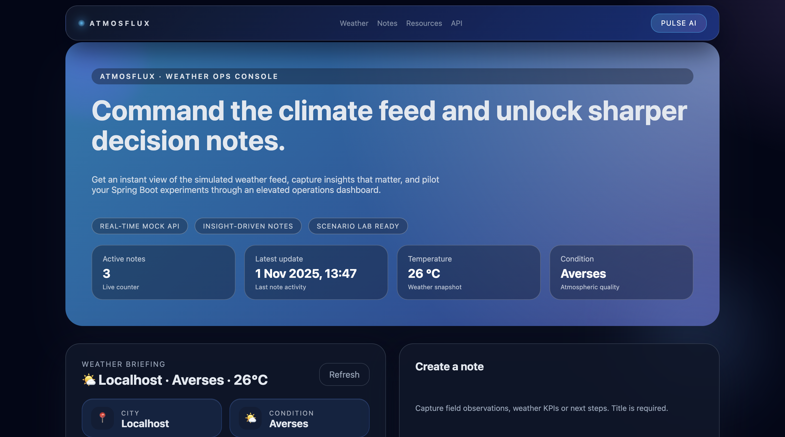

# AtmosFlux — Weather Intelligence Sandbox

AtmosFlux pairs a Spring Boot 3 backend with a premium single-page console so you can demo, prototype, or pitch weather-driven experiences without scaffolding a standalone frontend build. Everything ships in one Maven project: REST APIs, Flyway-ready persistence, Swagger docs, and a cinematic dark UI.



---

## Why AtmosFlux?

- **Show, don’t tell** – Launch a polished console from `index.html` that highlights mock weather insights, live stats, and note workflows in seconds.
- **API-first** – `/meteo` delivers a curated JSON payload that is trivial to extend or replace with a live provider. `/notes` exposes full CRUD with validation and error handling.
- **Production tooling baked in** – Springdoc OpenAPI, Actuator, Flyway, and dual database profiles (H2 + PostgreSQL) are ready out of the box.
- **GitHub-ready** – Clean project structure, documentation, and screenshot assets ideal for portfolio or client-facing repos.

---

## Architecture Overview

| Layer        | Technology                                                                 |
|--------------|------------------------------------------------------------------------------|
| Backend      | Spring Boot 3.3 · Spring Web · Validation · Actuator                         |
| Persistence  | Spring Data JPA · H2 (default) · PostgreSQL (docker profile) · Flyway        |
| Frontend     | Static HTML/CSS/JS hosted in `src/main/resources/static/index.html`          |
| Tooling      | Maven Wrapper · springdoc-openapi · Docker Compose                           |

```
src/
├── main
│   ├── java/com/example/atmosflux/...     # API, services, repositories, domain
│   └── resources
│       ├── static/index.html              # AtmosFlux console (no build step required)
│       ├── static/ATMOSFLUX.png           # Screenshot used in README
│       └── application.properties         # H2 profile
└── test                                   # Unit / integration tests
```

---

## Quick Start

```bash
# Clone
git clone https://github.com/zaka41a/AtmosFlux.git
cd AtmosFlux

# Build artefacts (runs the test suite)
./mvnw clean package

# Launch on the default port (8080)
./mvnw spring-boot:run

# Need another port?
./mvnw spring-boot:run -Dspring-boot.run.arguments=--server.port=8081
```

Browse `http://localhost:8080/` to experience the console. Swagger UI lives at `/swagger-ui/index.html`, while Actuator endpoints are exposed under `/actuator`.

---

## Database Profiles

### H2 In-Memory (default)

- No external dependencies.
- Perfect for demos, quick QA checks, or GitHub Codespaces.
- Console available at `/h2-console` with username `sa` and empty password.

### PostgreSQL via Docker

```bash
docker compose up -d db
./mvnw spring-boot:run -Dspring-boot.run.profiles=docker
```

The compose stack provisions PostgreSQL on `localhost:5433` and pgAdmin at `http://localhost:8081/` (`admin@local.dev` / `admin`).

---

## API Surface

| Verb | Path                     | Purpose                                               |
|------|--------------------------|-------------------------------------------------------|
| GET  | `/meteo`                 | Simulated daily weather payload consumed by the UI   |
| GET  | `/notes`                 | Retrieve notes collection (POST/PUT/DELETE supported)|
| GET  | `/swagger-ui/index.html` | Interactive OpenAPI documentation                    |
| GET  | `/actuator/health`       | Health check for monitoring                          |

Error responses are JSON-formatted with descriptive messages to ease integration testing.

---

## Customisation Playbook

1. **Swap the weather provider** – Connect `/meteo` to OpenWeather, Meteomatics, or your proprietary feed and keep the UI untouched.
2. **Enrich the notes domain** – Add tags, attachments, or AI summarisation to transform the console into a lightweight analyst cockpit.
3. **Secure the surface** – Layer Spring Security with JWT/OAuth for multi-tenant scenarios or B2B demos.
4. **Ship as a container** – Use `./mvnw spring-boot:build-image` to produce an OCI image ready for registries and platforms like Heroku or Fly.io.

---

## Contributing

PRs and issues are welcome. Please:

- Follow the typography and colour tokens defined in `index.html` when adding UI elements.
- Run `./mvnw test` before submitting changes.
- Include screenshots or recordings when modifying the console experience.

---

Bring AtmosFlux into your next GitHub showcase, client pitch, or internal lab. Enjoy the flight! 🎛️✨
